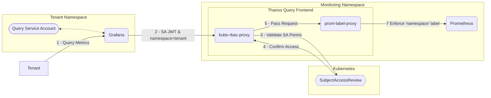

# Prometheus querier-frontend

The querier frontend utilizes two proxies to provide isolated access to Prometheus (or the Thanos querier.) RBAC is validated using the [kube-rbac-proxy](https://github.com/brancz/kube-rbac-proxy) which then passes the request onwards to a [prom-label-proxy](https://github.com/prometheus-community/prom-label-proxy) which in turn enforces the originating tenants `namespace` label.

## Structure

### Manifests

#### [config.yaml](config.yaml)

Contains config for `kube-rbac-proxy`. Extracts the value from the `namespace` query parameter & creates a `SubjectAccessReview` to confirm the requesting account (which is derivated from the attached Authorization header, usually a Service Accounts JWT) has permissions on the `pods/metrics` subresource. The verb corresponds to the [HTTP Method used for the call]( https://github.com/brancz/kube-rbac-proxy/blob/master/pkg/proxy/proxy.go#L48-L60.). This setup is built around all calls to Prometheus being strictly `GET` to limit the amount of permissions needed.

#### [deployment.yaml](deployment.yaml)

Deployment which creates a Pod including containers for both `kube-rbac-proxy` & `prom-label-proxy`. `kube-rbac-proxy` is the outward facing container (as can be seen in [service.yaml](service.yaml)), which forwards any successfully authenticated requests to `prom-label-proxy`. The config for `prom-label-proxy` is passed as args in this deployment, as it simply checks for a `namespace` label & sets the final upstream, which in this case is the Thanos querier. The final upstream can also be exchanged for the Thanos sidecar or Prometheus instance directly.

#### [serviceaccount.yaml](serviceaccount.yaml)

`kube-rbac-proxy` requires the `system:auth-delegator` `ClusterRole` to create `SubjectAccessReviews`.

#### [role.yaml](role.yaml)

Creates a `ClusterRole` "namespace-metrics-viewer" which grants get on the `pods/metrics` subresource. Tenants will require these rights to view metrics in their namespace.